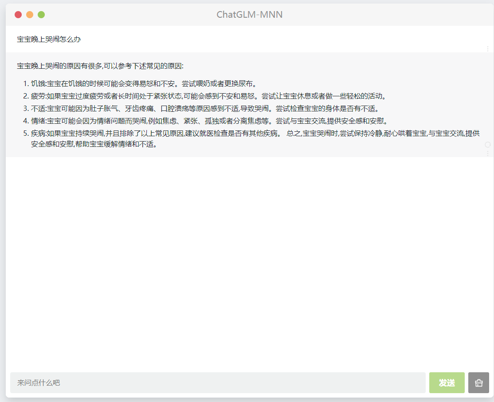

# ChatGLM-MNN

[Read me in english ](./README_en.md)

## Describe
该项目将模型[ChatGLM-6B](https://huggingface.co/THUDM/chatglm-6b)转换到`MNN`并使用`C++`进行推理。
在实现上做了如下优化：

1. 对其中的词表做了部分删减，删除了模型中未使用的前20000个图片词；将`vocab`, `embedding`, `lm_head`的大小从150528缩小到130528;
2. `Embedding`操作调用次数较少，使用`fseek`, `fread`加载的方式降低内存;
3. `lm_head`操作为`[num, 4096] @ [4096, 130528]`，转换为`[130528, 4096] @ [4096, 1]`;
4. 原模型对显存要求较高；将模型按层拆分成28个模型，可以根据用户显存大小动态将计算任务分配给GPU和CPU，充分利用GPU与CPU内存与算力; 即使小显存显卡也可以加速生成。
5. 针对端侧设备可以逐次加载计算，`2G`内存的Android设备也可以执行推理（速度较慢）。
6. **现已提供[ONNX导出方法](./export_script)和模型，可以使用其他框架部署；[点击下载](https://github.com/wangzhaode/ChatGLM-MNN/releases/tag/v0.4)**

目前支持命令行对话与Web UI对话两种形式的Demo


## Speed

移动端：将分段模型逐个加载推理可以在内存大小大于`2G`的设备执行推理，实验性测试性能较差；目前性能约为：63 `s/word`。

PC测试平台：
- Memory: 32G (+32G Swap)
- CPU: AMD Ryzen 9 3900X 12-Core Processor
- GPU: GeForce RTX 2080 Ti

### FP Model
仅测试浮点模型(CPU: fp32/ GPU: fp16)，输入`你好`，在回复完内容相同的情况下，平均生成一个词语的时间(`s/word`)对比如下：

|   impl  |   GPU + CPU   | CPU only  |
|---------|---------------|-----------|
|   MNN   |      0.292    |   0.877   |
| Pytorch | out of memory |   1.344   |

### Quantize Model
`TODO`


## Usage
### 1. 下载本项目
```bash
git clone https://github.com/wangzhaode/ChatGLM-MNN.git
```
### 2. 编译MNN库
- 克隆MNN项目，最新正式版是2.5.0
```bash
git clone https://github.com/alibaba/MNN.git -b 2.5.0
```

- 进入MNN项目, 并构建一个Build目录准备编译
```bash
cd MNN
mkdir build && cd build
```

- 正式编译，可选CPU/CUDA/OpenCL三种，推荐有英伟达显卡的选择CUDA，没显卡的选CPU,有AMD显卡的选择OpenCL

```bash
# CPU only（Suport Linux/Mac/Windows）
cmake -DCMAKE_BUILD_TYPE=Release ..

# using CUDA(Support Linux)
cmake -DCMAKE_BUILD_TYPE=Release -DMNN_CUDA=ON ..

# using OPENCL
cmake -DCMAKE_BUILD_TYPE=Release -DMNN_OPENCL=ON -DMNN_USE_SYSTEM_LIB=ON -DMNN_SEP_BUILD=OFF ..

# start build(support Linux/Mac)
make -j$(nproc)

# start build(support Windows)
cmake --build . -- /m:8

```

- 回到ChatGLM-MNN

```bash
cd ../..
```

- 将MNN库的编译结果拷贝给ChatGLM-MNN
```bash
# for Linux/Mac
cp -r MNN/include/MNN include
cp MNN/build/libMNN.so libs/
cp MNN/build/express/*.so  libs/

# for windows
cp -r MNN/include/MNN include
cp MNN/build/Debug/MNN.dll libs/
cp MNN/build/Debug/MNN.lib libs/
```

- 对于Windows，还需要下载一下第三方库pthread，下载[地址](https://gigenet.dl.sourceforge.net/project/pthreads4w/pthreads-w32-2-9-1-release.zip),下载后解压，打开Pre-built.2\lib\x64， 将pthreadVC2.lib文件拷贝到ChatGLM-MNN的libs文件夹。打开Pre-built.2\include,将下面三个.h文件都放到ChatGLM-MNN的include文件夹。对于windows，项目的最终文件结构如下：
```bash
├───libs
│   ├───MNN.dll
│   ├───MNN.lib
│   └───pthreadVC2.lib
├───include
│   ├───cppjieba
│   ├───limonp
│   ├───MNN
│   ├───chat.hpp
│   ├───httplib.h
│   ├───pthread.h
│   ├───sched.h
│   └───semaphore.h
```


### 3. Download Models
从 `github release` 下载模型文件到 `/path/to/ChatGLM-MNN/resource/models`， 如下：
- 对于Linux/Mac
```bash
cd resource/models
# 下载fp16权值模型, 几乎没有精度损失
./download_models.sh fp16
# 对于中国用户，可以使用第三方服务加速下载fp16模型
./download_models.sh fp16 proxy

# 下载int8权值模型，极少精度损失，推荐使用
./download_models.sh int8
# 对于中国用户，可以使用第三方服务加速下载int8模型
./download_models.sh int8 proxy

# 下载int4权值模型，有一定精度损失
./download_models.sh int4 
# 对于中国用户，可以使用第三方服务加速下载int4模型
./download_models.sh int4 proxy
```
- 对于windows,将上面的`xxx.sh`替换为`xxx.ps1`文件即可，例如：
```powershell
cd resource/models

# 下载fp16权值模型, 几乎没有精度损失
./download_models.ps1 fp16
# 对于中国用户，可以使用第三方服务加速下载fp16模型
./download_models.ps1 fp16 proxy
```

### 4. Build and Run

##### Mac/Linux/Windows:
```bash
mkdir build && cd build
# for CPU
cmake ..
# for GPU
cmake -D WITH_CUDA=on ..
# for mini memory device
cmake -D BUILD_MINI_MEM_MODE=on ..

# start build(support Linux/Mac)
make -j$(nproc)

# start build(support Windows)
cmake --build . -- /m:8

# run (for Linux/Mac)
./cli_demo # cli demo
./web_demo # web ui demo

# run (for Windows)
.\Debug\cli_demo.exe
.\Debug\web_demo.exe
```


##### Android:
```
mkdir build
cd build
../android_build.sh
make -j8
```
##### Docker
1. 对于Linux系统，有支持cuda的英伟达显卡，想要运行fp16模型的 
```bash
# 开始编译,
docker build . -t chatglm-mnn:cuda_fp16_v0.1 -f dockerfiles/cuda_fp16.Dockerfile

# 直接运行web版, 然后浏览器打开对应ip的5088端口即可访问web页面
docker run --gpus all -d -p 5088:5088 --restart always --name chatglm-mnn chatglm-mnn:cuda_fp16_v0.1

# 直接运行(cli版)
docker run --gpus all -it \
  --name chatglm-mnn \
  chatglm-mnn:cuda_fp16_v0.1 \
  bash -c "cd /workspace/build && ./cli_demo"
```
2. 对于Linux系统，有支持cuda的英伟达显卡，想要运行int8模型的 
```bash
# 开始编译
docker build . -t chatglm-mnn:cuda_int8_v0.1 -f dockerfiles/cuda_int8.Dockerfile

# 直接运行（web版)
docker run --gpus all -d -p 5088:5088 --restart always --name chatglm-mnn chatglm-mnn:cuda_int8_v0.1

# 直接运行(cli版)
docker run --gpus all -it \
  --name chatglm-mnn \
  chatglm-mnn:cuda_int8_v0.1 \
  bash -c "cd /workspace/build && ./cli_demo -d int8"
```
3. 对于Linux/Mac系统，无英伟达显卡，想要运行fp16的(大概需要24G内存）。
```bash
# 开始编译
docker build . -t chatglm-mnn:cpu_fp16_normal_v0.1 -f dockerfiles/cpu_fp16_normal.Dockerfile

# 直接运行（web版)
docker run -d -p 5088:5088 --restart always --name chatglm-mnn chatglm-mnn:cpu_fp16_normal_v0.1

# 直接运行(cli版)
docker run -it \
  --name chatglm-mnn \
  chatglm-mnn:cpu_fp16_normal_v0.1 \
  bash -c "cd /workspace/build && ./cli_demo"
```
4. 对于Linux/Mac系统，无英伟达显卡，想要运行int8的(大概需要24G内存）。
```bash
# 开始编译
docker build . -t chatglm-mnn:cpu_int8_normal_v0.1 -f dockerfiles/cpu_int8_normal.Dockerfile

# 直接运行（web版)
docker run -d -p 5088:5088 --restart always --name chatglm-mnn chatglm-mnn:cpu_int8_normal_v0.1

# 直接运行(cli版)
docker run -it \
  --name chatglm-mnn \
  chatglm-mnn:cpu_int8_normal_v0.1 \
  bash -c "cd /workspace/build && ./cli_demo -d int8"
```


#### 5. Using GPU
默认用法为使用`CPU`, 使用`NVIDIA GPU`需要在编译MNN时添加宏`-DMNN_CUDA=ON`，使用其他GPU需要在编译MNN时添加宏`-DMNN_OPENCL=ON -DMNN_USE_SYSTEM_LIB=ON -DMNN_SEP_BUILD=OFF`；
在创建`ChatGLM`时指定显存大小，如下：
```cpp
// 8G CUDA Memory
ChatGLM chatglm(8);
// 命令式
std::cout << chatglm.response("你好");
// 交互式
chatglm.chat();
```

## Example

Q: 用Python帮我写一段快速排序代码

A: 当然可以!以下是使用Python实现快速排序算法的示例代码:

```python
def quick_sort(arr):
    if len(arr) <= 1:
        return arr
    else:
        pivot = arr[0]
        left = []
        right = []
        for i in range(1, len(arr)):
            if arr[i] < pivot:
                left.append(arr[i])
            else:
                right.append(arr[i])
        return quick_sort(left) + [pivot] + quick_sort(right)
```

这个实现中,我们首先检查传入的数组长度是否小于等于1。如果是,我们直接返回该数组,因为这种情况下快速排序是不稳定的。否则,我们选择数组的第一个元素作为基准点(pivot),并将数组分为两个部分:左边的部分的所有元素都小于基准点,右边的部分的所有元素都大于基准点。然后我们递归地对左边和右边的部分执行快速排序,并将结果拼接起来。最后,我们递归地对左右两个部分执行相同的操作,并返回结果。

你可以像这样调用这个函数:

```python
arr = [3, 6, 1, 9, 2, 5, 8, 4]
sorted_arr = quick_sort(arr)
print(sorted_arr)
```

这将输出 `[1, 2, 3, 4, 5, 6, 7, 8, 9]`,表示快速排序已成功地对数组进行了排序。

---

Q: 内存泄露如何定位

A: 内存泄漏(Memory Leak)是指程序在运行过程中,占用的内存空间不断增加,最终导致程序无法继续运行,或者运行效率降低。

以下是一些常见的内存泄漏检查方法:

1. 使用内存分析工具:例如Eclipse Memory Analyzer、VisualVM等,这些工具可以帮助检测程序中未释放的内存空间,以及内存分配的异常。

2. 检查变量的生命周期:如果一个变量在它的生命周期内没有被释放,那么它的内存空间就会被一直占用,最终导致内存泄漏。可以通过查看变量的生命周期信息来检查是否存在这个问题。

3. 检查代码中的异常:如果程序在执行过程中出现了异常,而没有释放所占用的内存空间,也会导致内存泄漏。可以通过调试程序,查找并释放这些内存空间。

4. 优化代码:如果程序中的代码存在内存泄漏问题,那么可能是因为程序的性能问题或者内存占用过高导致的。可以通过优化代码,减少内存分配和释放的次数,来解决这个问题。

5. 定期清理无用的数据:如果程序中存在大量的无用数据,也会导致内存泄漏。可以通过定期清理这些数据,释放内存空间。

内存泄漏问题的解决需要从多个方面入手,通过不断地调试和优化程序,来找到内存泄漏的根本原因,并有效地解决问题。

---
Q: 北京有什么特色小吃？

A: 北京是中国历史文化名城,也是中国美食之都之一,有许多特色小吃。以下是一些著名的北京特色小吃:

1. 炸酱面:炸酱面是中国传统面食之一,以黄酱和肉末为主要材料,配以豆瓣酱、黄瓜丝和豆芽等配料,味道鲜美。

2. 烤鸭:烤鸭是北京最著名的美食之一,以薄饼和鸭肉为主要材料,烤制过程中还会加入葱、姜等调料,口感鲜美。

3. 豆汁:豆汁是一种传统的北京小吃,以黄豆为主要原料,配以辣椒油、醋、蒜泥等调料,味道酸甜可口。

4. 羊蝎子:羊蝎子是一道以羊肉和羊肝为主要材料的炖菜,口感鲜美,营养丰富。

5. 糖葫芦:糖葫芦是一种传统的北京小吃,以草莓、山楂等水果为主料,沾上糖浆,口感酸甜可口。

6. 煎饼果子:煎饼果子是一种流行的中式早餐,以薄饼和蛋、肉松、油条等为主要材料,口感酥脆。

7. 驴打滚:驴打滚是一种传统的北京小吃,以糯米粉和豆沙为主要材料,通过卷起来和炸的方式制作,口感香甜。

这只是北京众多特色小吃中的一小部分,北京还有很多其他美食,如北京火锅、北京炸酱面、北京小吃街等等,值得一试。

## Reference
- [ChatGLM-6B](https://huggingface.co/THUDM/chatglm-6b)
- [cpp-httplib](https://github.com/yhirose/cpp-httplib)
- [chatgpt-web](https://github.com/xqdoo00o/chatgpt-web)
- [cppjieba](https://github.com/yanyiwu/cppjieba)
